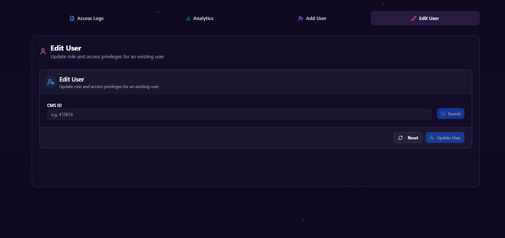
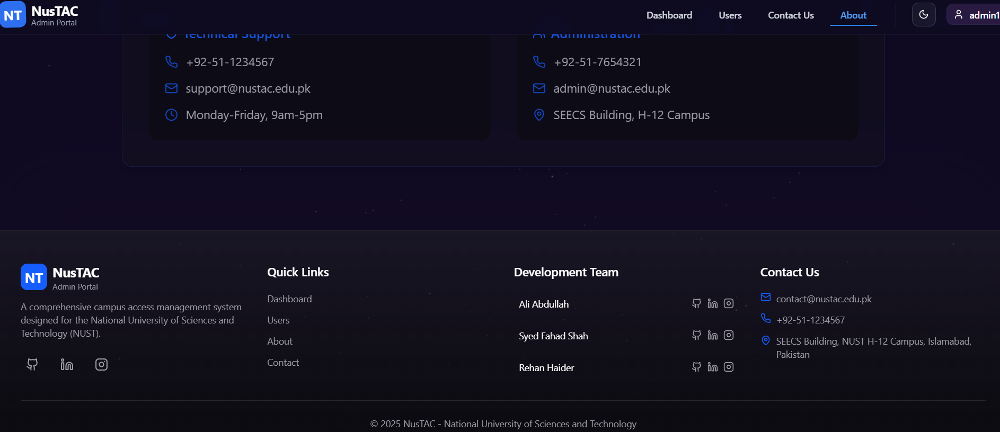

# NusTAC Admin Portal

<div align="center">
  
</div>

## Secure Campus Access Management - Admin Dashboard

A secure, modern admin dashboard for managing campus access control at NUST

**[View Demo »](https://admin-portal.vercel.app)**

[Features](#key-features) · [Tech Stack](#technology-stack) · [Getting Started](#getting-started) · [Screenshots](#screenshots)

## Overview

The NusTAC Admin Portal is the administrative component of a comprehensive campus access control system designed for the National University of Sciences and Technology (NUST) in Islamabad, Pakistan. This portal provides administrators with a powerful interface to manage users, monitor access logs, and analyze access patterns across the campus.

The admin portal is one part of a three-component system:
- **Admin Portal** (this repository) - Web dashboard for system administration
- **Mobile Application** - QR code generation for user access
- **Scanner Application** - Verification system for access points

## Key Features

- **User Management**
  - Create, edit, view, and delete users
  - Assign department-specific access permissions
  - Role-based access control (Teacher, Student, Admin, Lab Instructor, Intern)
  - Batch actions and search/filter functionality

- **Access Logs**
  - Real-time monitoring of all access attempts
  - Comprehensive filtering by user, location, time, and access status
  - Exportable logs for reporting and analysis

- **Analytics Dashboard**
  - Visual representation of access patterns
  - Department-specific access statistics
  - Temporal analysis of building usage
  - Identification of access anomalies

- **Security**
  - Secure authentication for admin users
  - Detailed audit logging
  - Role-based dashboard views

## Technology Stack

- **Frontend Framework**: Next.js 14 (App Router)
- **UI Components**: shadcn/ui with Tailwind CSS
- **State Management**: React hooks
- **Database**: Convex real-time database
- **Authentication**: Custom auth system
- **Data Visualization**: Recharts
- **Deployment**: Vercel

## Getting Started

### Prerequisites

- Node.js 18.0.0 or later
- npm or yarn
- Convex account for database

### Installation

1. Clone the repository
   ```bash
   git clone https://github.com/ali-abdullah9/admin-portal.git
   cd admin-portal
   ```

2. Install dependencies
   ```bash
   npm install
   # or
   yarn install
   ```

3. Set up environment variables
   ```bash
   cp .env.example .env.local
   # Edit .env.local with your Convex API keys
   ```

4. Start the development server
   ```bash
   npm run dev
   # or
   yarn dev
   ```

5. Open [http://localhost:3000](http://localhost:3000) in your browser to see the application

### Project Structure

```
admin-portal/
├── app/                  # Next.js app router
│   ├── about/            # About page
│   ├── contact/          # Contact page
│   ├── logs/             # Access logs page
│   ├── login/            # Authentication page
│   └── users/            # User management page
├── components/           # Reusable UI components
│   ├── layout/           # Layout components
│   └── ui/               # UI components from shadcn
├── convex/               # Convex database schema and queries
├── lib/                  # Utility functions
├── public/               # Static assets
└── types/                # TypeScript type definitions
```

## Authentication

The admin portal is restricted to authorized administrators using a secure authentication system. For development purposes, you can use these test credentials:

- Username: `admin1`, Password: `admin123`, Role: `Admin`
- Username: `admin2`, Password: `admin456`, Role: `Admin`
- Username: `moderator`, Password: `mod123`, Role: `Moderator`

## Screenshots


*Dashboard view*

*Dashboard view with Access Log*

*Dashboard view with analytics*

*Dashboard view with Add User Form*

*Dashboard view with Edit User Form*


*User management interface*


*Contact us interface*


*About us interface*

## Integration with Other NusTAC Components

The Admin Portal communicates with other NusTAC system components:

- **Mobile App**: Manages the same user database that the mobile app uses for QR generation
- **Scanner App**: Receives and displays access log data from scanner verification points

## Development Roadmap

- [ ] Advanced analytics dashboard
- [ ] User import/export functionality
- [ ] Role-based access control for admin users
- [ ] Multi-factor authentication
- [ ] Enhanced reporting features

## Contributors

- **Ali Abdullah** - Admin Portal Development - [GitHub](https://github.com/ali-abdullah9)

## License

This project is licensed under the MIT License - see the LICENSE file for details.

## Acknowledgements

- [Next.js](https://nextjs.org/) - The React framework
- [shadcn/ui](https://ui.shadcn.com/) - UI component system
- [Convex](https://www.convex.dev/) - Backend database
- [Tailwind CSS](https://tailwindcss.com/) - CSS framework
- [Lucide Icons](https://lucide.dev/) - Icon library
